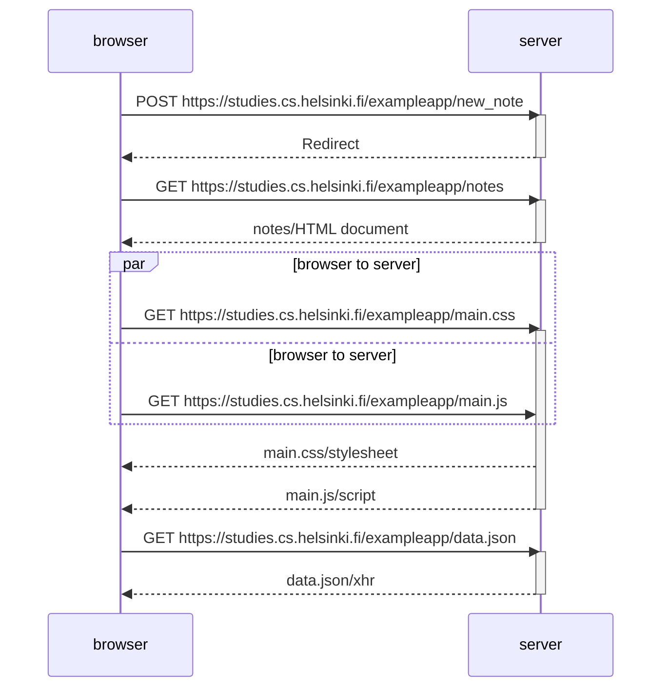

```mermaid
sequenceDiagram
    participant browser
    participant server

    browser->>server: POST https://studies.cs.helsinki.fi/exampleapp/new_note
    activate server
    server-->>browser: Redirect
    deactivate server

    browser->>server: GET https://studies.cs.helsinki.fi/exampleapp/notes
    activate server
    server-->>browser: notes/HTML document
    deactivate server

    par browser to server
    
        browser->>server: GET https://studies.cs.helsinki.fi/exampleapp/main.css
        activate server
    and browser to server

        browser->>server: GET https://studies.cs.helsinki.fi/exampleapp/main.js
    end
    server-->>browser: main.css/stylesheet
    server-->>browser: main.js/script
    deactivate server

    browser->>server: GET https://studies.cs.helsinki.fi/exampleapp/data.json
    activate server
    server-->>browser: data.json/xhr
    deactivate server
```